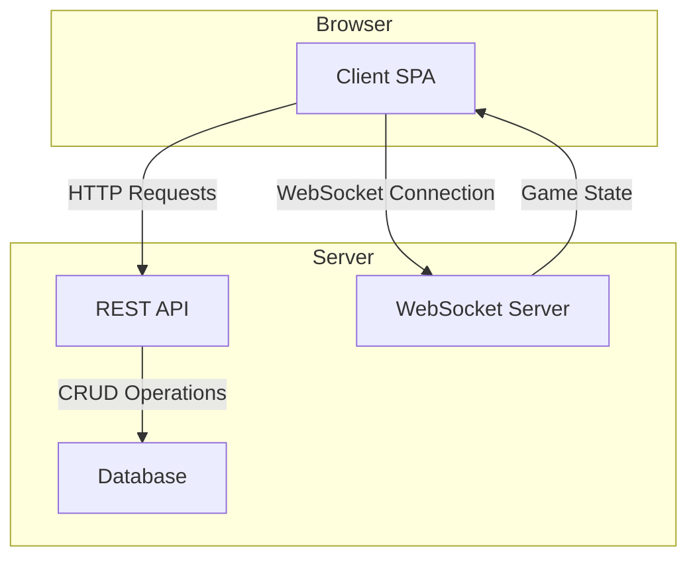

# System Patterns: Online Tic-Tac-Toe Game

## 1. System Architecture

A classic client-server architecture will be used.

- **Client (Frontend):** A single-page application (SPA) built with a modern JavaScript framework (e.g., Vue.js or React). It will be responsible for rendering the UI, handling user input, and communicating with the backend via HTTP and WebSockets.

- **Server (Backend):** A Node.js application (e.g., using Express.js or a similar framework) that serves the frontend application and provides a RESTful API for authentication and a WebSocket server for real-time game communication.

- **Database:** A simple database (e.g., SQLite for simplicity or a NoSQL option like MongoDB) to store user account information.

## 2. Key Design Patterns

### 2.1. Authentication
- **Token-based Authentication (JWT):** Upon successful login, the server will issue a JSON Web Token (JWT) to the client. The client will include this token in the header of subsequent API requests to authenticate the user. This is a stateless approach that works well with SPAs.

### 2.2. Real-time Communication
- **WebSocket Protocol:** WebSockets will be used for real-time, bidirectional communication between the client and server. This is essential for instantly updating the game state for both players. The backend will manage game rooms and broadcast moves to the appropriate clients.

### 2.3. State Management
- **Client-side State Management:** The frontend will manage its own UI state (e.g., the current view, form inputs). For shared application state, like user information or the current game state, a state management library (e.g., Pinia for Vue, Redux for React) might be used.
- **Server-side State Management:** The server will be the source of truth for all game logic and state. It will maintain the state of all active games in memory or a fast-access store like Redis.

## 3. Component Relationships

- The **Client SPA** handles all user interactions.
- It communicates with the **REST API** for user registration and login.
- It maintains a persistent **WebSocket Connection** with the WebSocket Server during gameplay.
- The **WebSocket Server** manages game logic and broadcasts updates to connected clients.
- The **REST API** interacts with the **Database** to manage user accounts.
